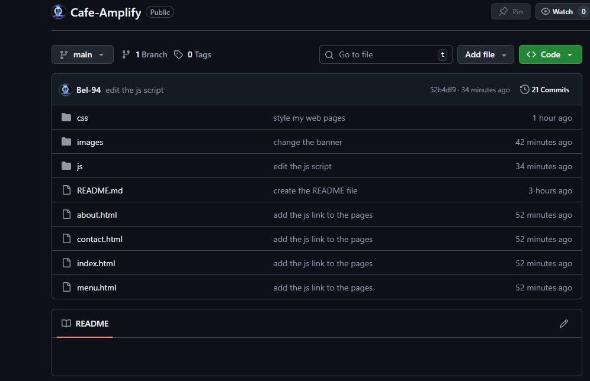
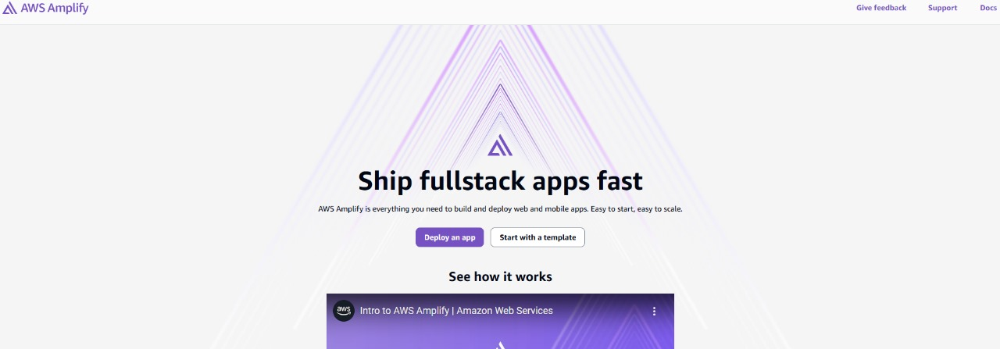
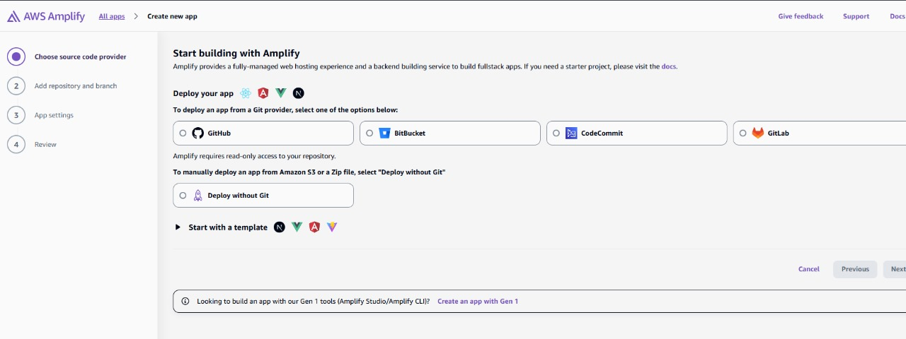
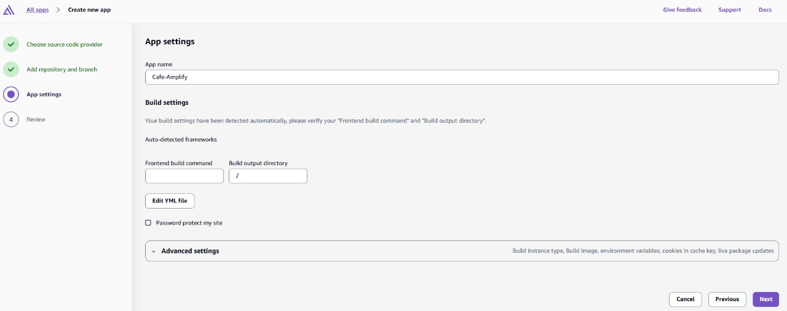
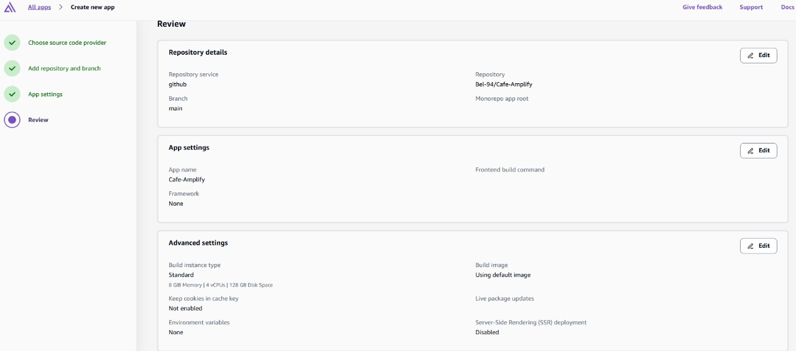
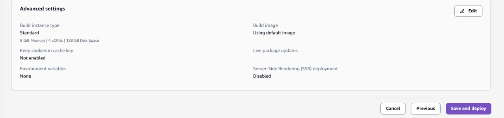
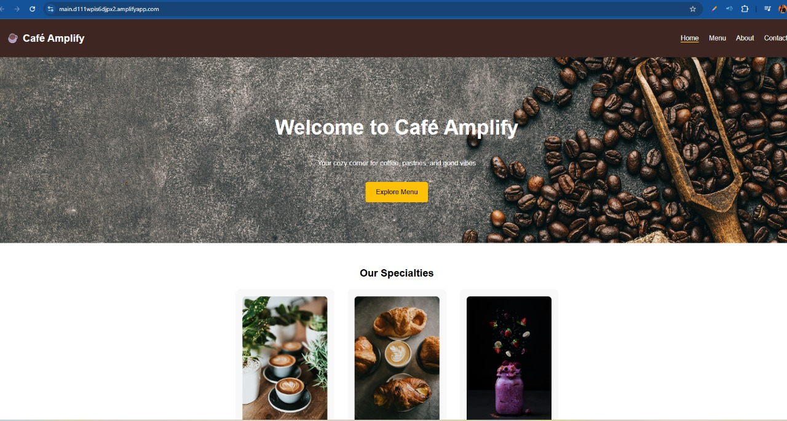
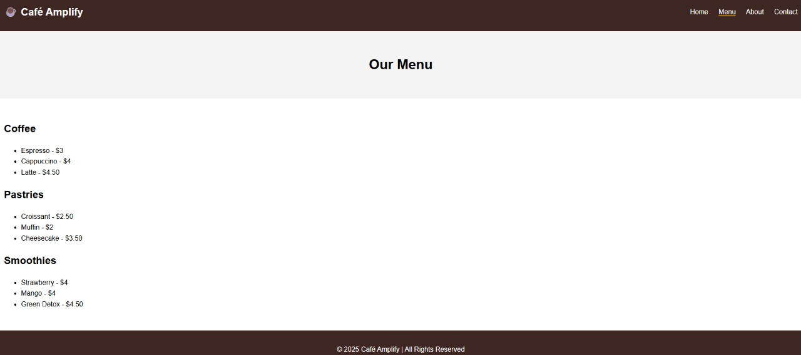
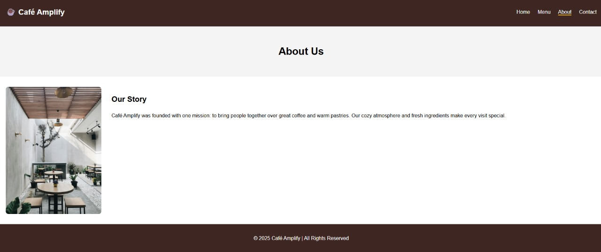
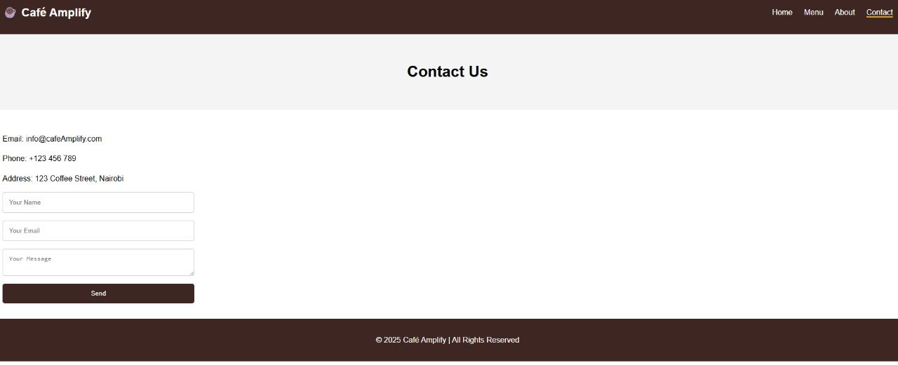

# ☕ Café Amplify – Static Website

A simple static website for a fictional café. Built with **HTML, CSS, and JavaScript**, and hosted on **AWS Amplify**.

---

## Project Structure

```bash
cafe-website/
│── index.html # Homepage
│── about.html # About page
│── menu.html # Menu page
│── contact.html # Contact page
│── css/
│ └── style.css # Styles
│── js/
│ └── script.js # Simple form handling
│── images/ # images
```

---

## Features
- Responsive static website
- Multi-page navigation (Home, Menu, About, Contact)
- Contact form with JavaScript validation
- Clean modern café-themed UI

---

## Deployment on AWS Amplify

### **Step 1 – Push to GitHub**
- Initialize a Git repo and push code.  
- Example:  

```bash
git init
git add .
git commit -m "Initial commit - Café Bliss static website"
git push -u origin main
```



---

## Step 2 – Open AWS Amplify
- Log in to [AWS Amplify Console](https://console.aws.amazon.com/amplify/). 



- Click **New App → Host Web App**.  



---

## Step 3 – Connect Repository
- Select **GitHub** as repo provider.  
- Choose your repo & branch (`main`).  


---

## Step 4 – Build Settings
- Amplify auto-detects static sites.  

- Accept default settings (no build needed).  



---

## Step 5 – Deploy
- **Review** your app settings 



- Click **Save & Deploy**. 



- Amplify provisions hosting and builds automatically.  

---

## Step 6 – Live Website
- Amplify gives you a live URL:  
  `https://main.d22782xas97vha.amplifyapp.com/`  

## My live site
**Homepage**



**Menu Page**



**About Us Page**



**Contact Us Page**



---

## Tech Stack
- HTML  
- CSS  
- JavaScript  
- AWS Amplify (Hosting)  

---

## Author
**Belinda Ntinyari** – [Medium](https://medium.com/@ntinyaribelinda) | [LinkedIn](https://www.linkedin.com/in/belinda-ntinyari/)

---

## License
This project is licensed under the [MIT License](https://opensource.org/licenses/MIT).